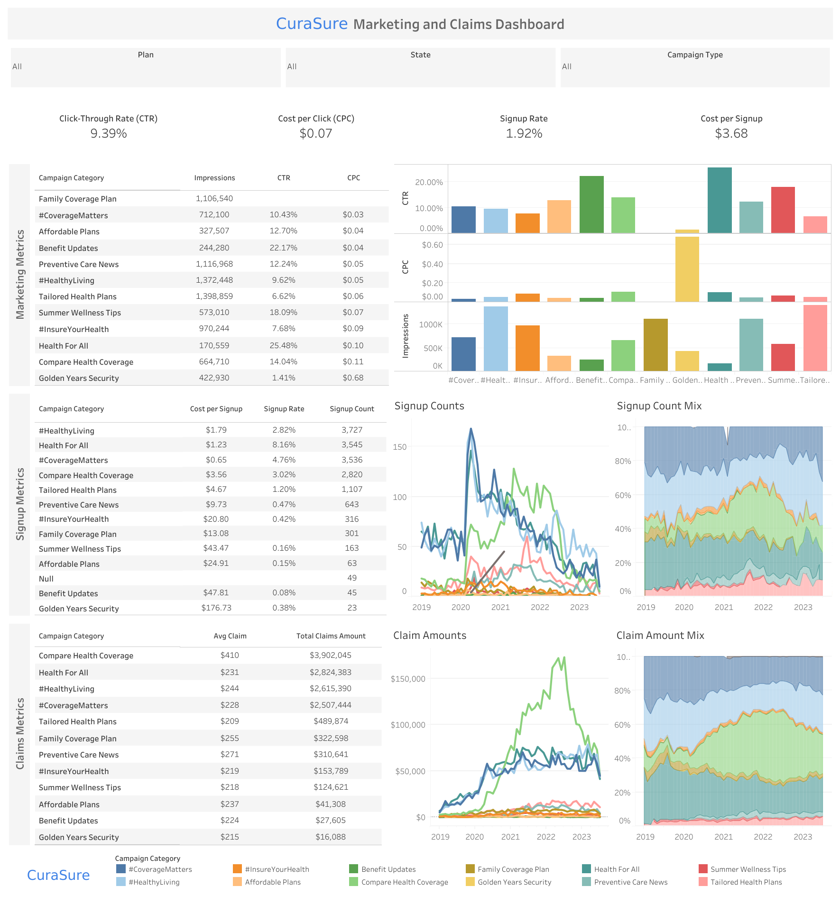
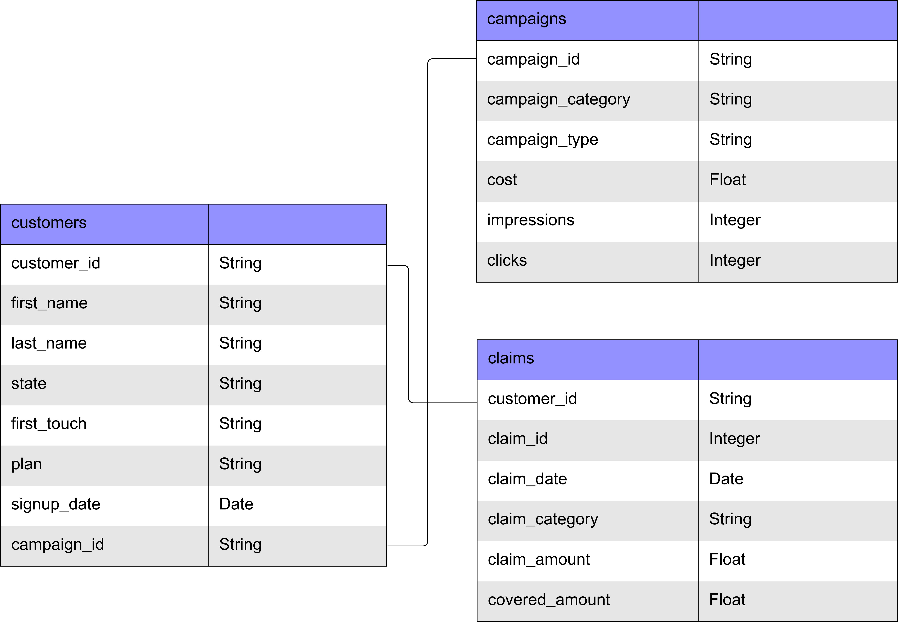

# CuraSure Marketing and Claims Analysis

CuraSure is a medical insurance company that wanted to analyze its marketing campaign and customer claims data. The marketing team wanted to know their to-date impact of their marketing campaign categories since 2019, and what trends and insights the key metrics uncovered when analyzed across categories, plans, states, and category types.

The key performance indicators (KPIs) for this analysis are:
- <b>Click-through rate (CTR)</b> 
- <b>Cost per click (CPC)</b> sdf
- <b>Signup rate</b> sdf
- <b>Cost per signup</b> sdf
- <b>Claim amount</b> sdf
- <b>Claim count</b> sdf

While the key dimensions to drill down on are:
- <b>Plan</b> 
- <b>State</b> 
- <b>Campaign type</b> 
- <b>Campaign category</b> 

## Analysis and Dashboard
I created an interactive Tableau dashboard <a href="https://public.tableau.com/app/profile/minjoo.kim6286/viz/CuraSureMarketingandClaimsDashboard/Dashboard1?publish=yes">here</a> that shows all marketing, signup, and claims metrics at a glance.

### Marketing Insights:
- Overall CTR was 9.46%, with CPC being $0.04
- Overall signup rate was 2.04% with cost per signup being $2.18

- #CoverageMatters consistently performed among the best across all plans 

- Campaigns that were smaller in scope and more targeted like Summer Wellness Tips and Affordable Plans performed the best, with a \$0.02, \$0.03 CPC

- Data for the Family Coverage Plan was missing its key metrics - follow-up questions clarified that its marketing materials had the wrong link attached, and so analyzers/activity trackers had no activity to pick up on

### Signup Insights:
- Signups peaked during peak pandemic years, and steadily declined in the years after
  - When sliced across campaign types:
    - Covid Awareness showed the most signups and claims from Tailored Health Plans campaign towards the later years of the pandemic
    - Product promotions showed the highest signup rate and lowest cost per signup, with most signups coming from the #CoverageMatters and Compare Health Coverage campaigns
    - 

### Claims Insights:
- Most submitted claims came from the Compare Health Coverage campaign with an average claim amount of $410.

## Recommendations
- #CoverageMatters performed consistently high across all metric analyses over the years, while the Golden Years Security campaign performed consistently poorly. Reallocating the Golden Years Security budget to high-performers like #CoverageMatters and new campaigns would return more on investment.

Below is the ERD diagram for the data.
